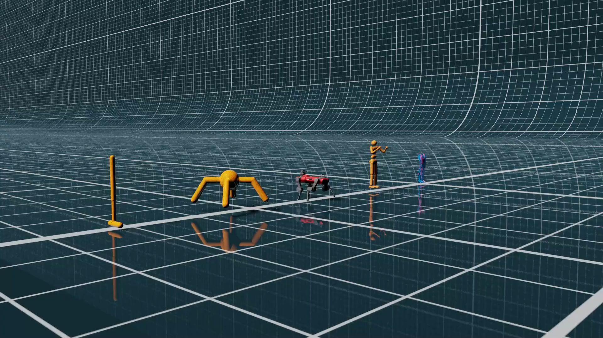

# Adaptive Horizon Actor Critic (AHAC)

This repository contains the implementation for the paper [Adaptive Horizon Actor-Critic for Policy Learning in Contact-Rich Differentiable Simulation](https://adaptive-horizon-actor-critic.github.io/) (ICML 2024).

In this paper, we build on previous work in differentiable simulation policy optimization, to create Adaptive Horizon Actor Critic (AHAC). Our approach deals with gradient error arising from stiff contact by dynamically adapting its model-based horizon to fit one robot gait and avoid excessive contact. This results in a higher performant and easier to use algorithm than its predecessor [Short Horizon Actor Critic (SHAC)](https://short-horizon-actor-critic.github.io/) while also outperofming PPO by 40% across a set of high-dimensional locomotion tasks.

[](https://adaptive-horizon-actor-critic.github.io/media/all_envs_trimmed.mp4)

## Installation

 `git clone https://github.com/imgeorgiev/DiffRL --recursive`


Setup this project with Anaconda
```
conda env create -f environment.yml
conda activate diffrl
pip install -e dflex
pip install -e .
```

For an unknown reason, you need to symlink cuda libraries for ninja to work:
```
ln -s $CONDA_PREFIX/lib $CONDA_PREFIX/lib64
```

If you want SVG as a baseline:

```
pip install -e externals/svg
```

## Training

```
python train.py alg=ahac env=ant
```

where you can change `alg` and `env` freely based in the provided hydra configurations.

The training script outputs tensorboard logs by default. If you want to use wandb, you can add the additional flag `general.run_wandb=True` and specify `wandb.project=<name>` `wnadb.entity=<entity>`.

Note that dflex is not fully deterministic due to GPU acceleration and cannot reproduce the same results given then same seed.


## Testing

You can load a policy and evluate it without training. Works only for AHAC and SHAC algorithms.

```
python train.py alg=ahac env=ant train=False checkpoint=<policy_path>
```

You can also control the number of eval episodes with `env.player.games_num=10`.

## Generating rendering files

The `general.render` flag indicates whether to export the video of the task execution. If does, the exported video is encoded in `.usd` format, and stored in the `examples/output` folder. To visualize the exported `.usd` file, refer to [USD at NVIDIA](https://developer.nvidia.com/usd).

```python
python train.py alg=ahac env=ant general.train=False general.render=True general.checkpoint=<policy_path> env.config.stochastic_init=False env.player.games_num=1 env.player.num_actors=1 env.config.num_envs=1 alg.eval_runs=1
```

Once you have generated a rendering file you can load it in USD Composer to generate a image or video render like the one above. To install Omniverse, follow the [Omniverse Install Page](https://www.nvidia.com/en-us/omniverse/download/). Then install [USD Composer](https://www.nvidia.com/en-us/omniverse/apps/create/) from the Omniverse GUI. Start USD Composer and load the usd files generated by the script above.

 
